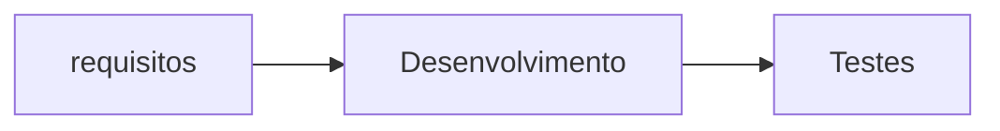
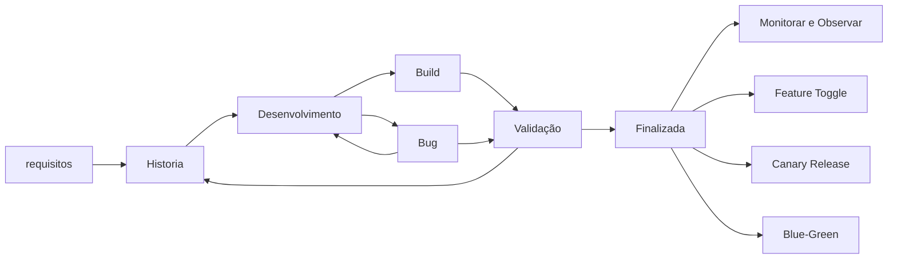

## cucuber project 

### play list de referência -> https://www.youtube.com/playlist?list=PLhJTa4U57yUuoZLHqiXXR97sMfy_Ia_3Q

### install

```
./mvnw clean install
```
### Especificação por exemplo

 - [x] bdd - desenvolvimento orientado por comportamento - descobrir falhas mais cedo

   - sanidade  - principais pontos do sistema
   - aceitação - fluxo do usuário 
   - funcional - funcionalidade específica
   - contrato  - assinaturas e tipagem
   - saúde dos endpoints - req, resp
 
 - [x] pipeline
   - saúde dos endpoints -> sanidade -> aceitação -> funcional -> contrato


   - Seus cenários do Cucumber devem direcionar sua implementação, não refleti-la.
     - Os recursos do cucumber devem ser escritos antes do código que implementa o recurso
   - Os contribuidores mais importantes dos requisitos não são programadores ou testadore - são analistas de negócios. Durante essa atividade, a principal responsabilidade dos dev e tester é fazer perguntas e garantir que eles entendam tudo.


 ### Vantagens do BDD
 - Testes de Aceitação
 - Especificações executáveis
 - Fácil compreensão
 - Pode ser usado para novos integrantes entenderem o sistema
 - Flexibilidade

 ### Desvantagens
 - Como são testes funcionais, podem falhar aleatóriamente (flake)
 - As features podem demorar demais para rodar
 - O pessoal do negócio pode não ler os cenários
 - Inserção de uma camada extra
 - Pode ser usado como estratégia para dados nos testes

 > Deve ser utilizado com Gherkin e Step com o negócio

 ### Time único
 - QA + DEV + Negócio - Reunião de 3 amigos
 - Alto nível de comunicação
 - Usamos cenários como documentação viva
 - Os testes viram estratégia de integração contínua
 - Analista de negócio tem que abraçar o BDD

### Time único devops - Perfil em "T"
 - Todo mundo faz tudo - cada um compartilha o seu conhecimento mais profundo
 - Sem analista de negócio
 - Sem dependência

### Processo BDD
 - Cada um prepara um N de histórias
 - Conversas com PO sobre os cenários ou critérios de aceite
 - Review por outr mebro da equipe
 - Mais conversas com o PO - muitas vezes assincronas por chat ou email
 - Gera compartilhamento na equipe
 - Review todos os níveis
 - Onboard para novos amigos

### Cenário
 - Um cenário é um exemplo concreto de uma regra de negócio
 - Um cenáriousa exemplos concretos para explicar idéias abstratas

#### Formato
 - **Dado**   - que está no sistema - qual sistema? qual local?
 - **Quando** - faço login          - quem entrou? era admin?
 - **Então**  - fui logado          - o que deve ocorrer quando o usuário loga?

logo...

 - **Dado**   - que esteja na pagina de login
 - **Quando** - logo com o admin "admin@dominio.com"
 - **Então**  - devo ver a mensagem de usuário logado com sucesso
 - **E**      - o nome do usuário deve aparecer ao lado direito do menu

pode melhorar...

 - **Quando** - logo com um usuário admin
 - **Então**  - devo ter a mensagem de usuário logado com sucesso
 - **E**      - o nome do usuário deve aparecer ao lado direito do menu

#### O que especificar - expecificando pelo exemplo
 - Queremos reponder a pergunta: "Como o sistema se comporta?"
 - Queremos descrever o que o sistema faz e não como ele faz

exemplo...

 - **Quando**  - pesquiso por smartphone
 - **E**       - filtro por produtos da"Apple"
 - **Então**   - somente os produtos da Apple são mostrados

> Assim resolvemos um problema de negócio com o cucumber com testes automatizados, especificação executável e documentação viva

### Gherkin

 - Linguagem natural com algumas funcionalidades
 - Pessoas técnicas e não técnicas podem entender ou escrever os cenários
 - Permite que os testes sejam executados, se tornando assim uma documentação viva 

#### Palavras chaves - sintaxe
 - Funcionalidade - Nome da funcionalidade
   - Cenarios agrupados por funcionalidades
   - Cada arquivo .feature deve mapear uma funcionalidade

exemplo...

 - Funcionalidade: Nome da funcionalidade
   - Cenário: Título (identifica o teste)
     - Dado: Configura o teste
     - Quando: Ação ou interação do usuário
     - Então: Resultado ou evidência
     - E / Mas: Continua passo "Dado", "Quando" ou "Então"

#### Context - Cenário de fundo
 - Reusa a configuração do teste
 - Idealmente não deve fazer ação ou verificação, só configuração
 - Tente não ter configurações complexas, somente o necessário para o entendimento
 - É executado antes de cada um dos cenários

#### Esquema de cenário
 - Meta cenário com parâmetros
